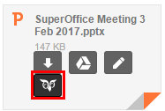

# Archive attachments

If the attachment is the only part of the e-mail you would like to keep for future reference, it is possible to archive an e-mail attachment in SuperOffice CRM as a document. Follow these steps:

1. In the Gmail inbox, open an e-mail containing one or more attachments.

2. Hold the mouse-pointer over the attachment you want to archive.  
    

3. Click the SuperOffice icon (). The dialog **Archive attachment as a SuperOffice document** opens.

    If the sender of the e-mail is not listed in SuperOffice CRM, a warning will appear at the top of the dialog. See [Handling e-mails from senders not registered in SuperOffice](Handling-e-mails-from-senders-not-listed-in-SuperOffice.md). A warning also appears if the sender is registered on multiple companies in SuperOffice CRM. See [Handling e-mails from senders with several listings](Handling-e-mails-from-senders-with-several-listings.md).

4. In the dialog, the **Company** and **Contact** fields have been filled in if the sender is registered in SuperOffice. Fill in relevant information in the following fields:

    [!include[Archiving options for Gmail](../includes/gmail-archiving-options.md)]

5. Click **Save**. The selected attachment is archived to SuperOffice CRM as a new document. You can then double-click the document in the **Activities** section tab to open it.

## What would you like to do now?

* [Archive incoming e-mail](e-mail-archive-incoming.md)
* [Archive outgoing e-mail](e-mail-archive-outgoing.md)
* [Create activity](Archive-e-mails-as-activities.md)
* [Create request](Archive-e-mails-as-requests.md)
* [Look up sender in SuperOffice](Add-sender-to-SuperOffice.md)
