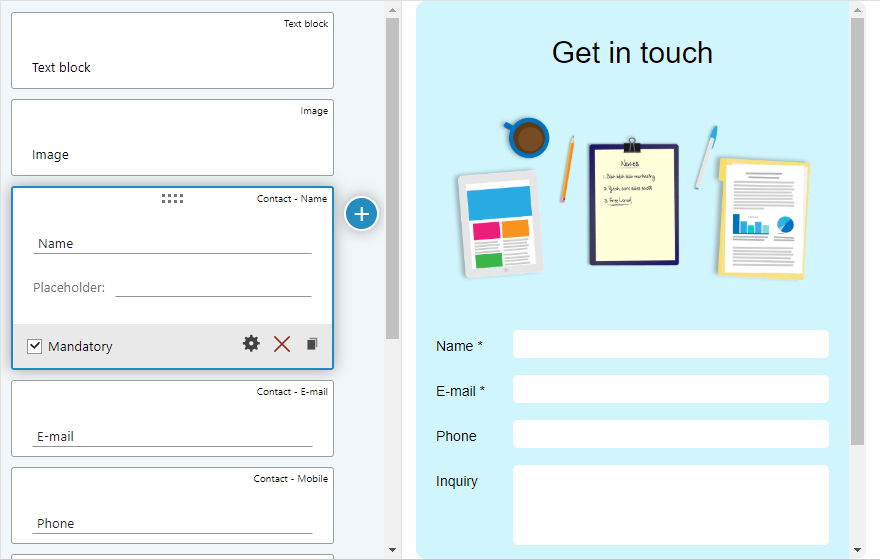

# Work with the form templates

<!-- Fix reuse ID=a1 -->

It is always a good idea to define a well-organised folder structure to get a better overview of your mailings, forms, templates, links and images in SuperOffice Marketing. You can create sub-folders in all folders, and you can place the appropriate mailings, forms, templates, links and images in each of these folders.

To create a new folder:

1. Select one of the main tabs in SuperOffice Marketing.
2. Optional: Open an existing folder to create a sub-folder. You may have to click the **All ...** button first.
3. Click the **Add folder** button. The **Folder properties** dialog appears.
4. Enter a descriptive name for the folder in the **Name** field.
5. Click **OK**. If the folder does not display in the list, click the **My ...** or **All ...** button.

## Using form templates

To access form templates, do as follows:

1. Select the **Form templates** tab.
2. Click **All templates**.
3. Click the  menu button next to the template you want to use.
4. Select **Copy to new form**. The template opens in the **Edit form** dialog. See [Create a new form](form_create.md).

## Create a new form template

To create a new form template from scratch:

1. Go to the **Form templates** tab.
2. If required, click **Add folder** to create a folder for the template.
3. Click **Add form**. The **Edit form** screen displays.
4. Enter a descriptive name for the template in the **Form name** field.
5. Complete the **Edit form** dialog as described in [Create a new form](form_create.md).
6. Click **Save** when you are done. The new form template displays in the templates list.

## Create a template based on existing form

1. Go to the **Forms** tab.
2. Click the  menu button next to the form you want to use as a basis for the template.
3. Select **Copy to template**. The **Edit form** screen opens.
4. Enter a descriptive name for the template in the **Form name** field.
5. If required, click **Folder** to select a folder for the template.
6. Make any necessary changes (see [Create a new form](form_create.md)).
7. Click **Save**.

