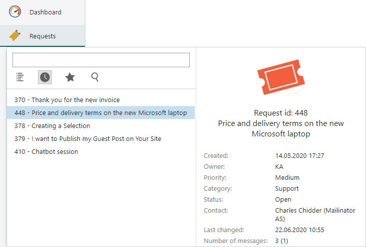

# Navigator options

> [!TIP]
> You can change the width of the navigator by clicking these buttons above the navigator:  

When you click a navigator button, one or more of the buttons below are displayed.

> [!TIP]
> If you hold the mouse pointer over a record in any of the lists below, a tooltip is displayed containing additional data about the record.

Click here to see a screenshot
<!-- Fix reuse ID=a1 -->

| Button | Description |
|:-:|---|
|        | **Actions/lists**: Click this button to show available actions/functions, lists and similar for the selected navigator button. |
|     | **History**: Click this button to show recently opened records, for instance request, contacts or selections. |
|  | **Favourites**: Click this button to view the records you have set as favourites. See [Favourites](rms.navigate.favourites.md). |
|      | **Search**: Click this button to show the results of the least search. The search field above the buttons is dynamic, so you only need to start typing your search phrase to initiate the search. |

> [!NOTE]
> Clicking the **Dashboard** button only opens the dashboard.

## Using the search field in the Navigator

1. Click **Requests**, **Customers**, **Selections**, **Knowledge Base** or **Marketing** in the Navigator on the left of the window. An empty field is displayed at the top. Below is a list of actions/functions and navigation options for the selected navigator button.

    ![icon][img1]

2. Type in the empty field the name of the record to search for. As you type in each letter, the list underneath displays all matches.

    Here are the available search options:

    * **Requests**: Enter a request ID or the first part of the request title.

    * **Customers**: Enter the first or last name of contact or the first part of the company name.

        <!-- Fix reuse ID=a11 -->
        [!include[Use wildcard in search](../../includes/tip-search-wildcard.md)]

    * **Selections**: Enter the first part of the selection title.

    * **Knowledge Base**: Enter any part of the FAQ name. To search for ALL records in the knowledge base, click **Search** in the list.

    * **Marketing**: Enter the first part of the mailing title.

3. When you find the required record, click it to move to the relevant record.

> [!TIP]
> If you hold the mouse pointer over a record in the list of search results, a <!-- Fix reuse ID=a12 --> containing additional data about the record.

![Example -screenshot][img2]

<!-- Referenced links -->
[1]:

<!-- Referenced images -->
[img1]: ../../../../media/icons/navigator-list.png
[img2]: ../media/navigator-preview-service.png
