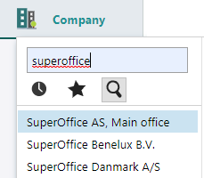
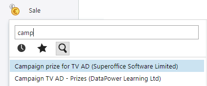
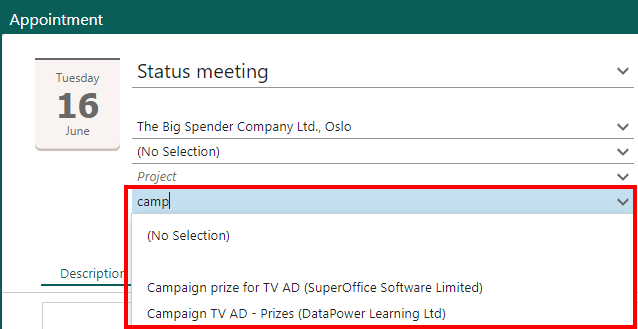

# FastSearcher

You can use FastSearcher in various ways:

* You can search directly from the Navigator to access the required company, contact, sales, project or selection.
* You can search for companies, contacts, sales, projects and selections from within dialogs containing the relevant fields, for example, the **Appointment** and **Document** dialogs, to link them to the appointment or document.
* You can search directly in the time zone selector to find the time zone for the required city or country.

## Using FastSearcher in the Navigator

<!-- Fix reuse ID=a1 -->

To search for a first AND middle name or for a contact with two last names, enter an underscore between the names. Example: "Carl\_Martin" or "Jennings\_Fletcher". The underscore functions as a wild card.

1. Click the word **Company**, **Contact**, **Sale**, **Project** or **Selection** in the Navigator on the left of the window. An empty field is displayed at the top. Below this is a list of records you have previously worked with (see [The History list](Using_the_history_list.md)).

    

2. Type in the empty field the name of the record to search for. As you type in each letter, the list underneath displays all matching records.

    Here are some examples:

    * You can search for a sale by entering the name of the sale or the name of a company linked to the sale, in the FastSearcher field for **Sales** in the Navigator.

        

    * You can search for a contact in the FastSearcher field for **Companies** in the Navigator.

3. Click the required record to open it.

## Using FastSearcher in dialogs

1. Open the relevant dialog.

2. In the relevant field, type the name of the record to search for. As you type in each letter, the list underneath displays all matches.

    

3. Click the required company, contact, sale, project or selection to link to the record.

> [!TIP]
>  
If you type a percent sign (%) in front of the search text, all records which *contain* the search text are displayed. For example, if you type %joh, both "Johnson Plumbing" and "Peter Johnson" are shown.

## Using FastSearcher in the time zone selector

1. Put the mouse pointer in the country field.
2. Enter the name of the city or country you want to find out the time zone for. If, for example, you don't know the time zone for Canberra, you can search for Canberra and bring up the relevant Australian time zone in the list.

> [!NOTE]
> Names of regions in the time zone selector will always be in English, while country names are dependent on the language settings in SuperOffice CRM. Don't forget this when searching for countries and regions.

1. Once you have found the required city or country, click the item to enable the required time zone.
